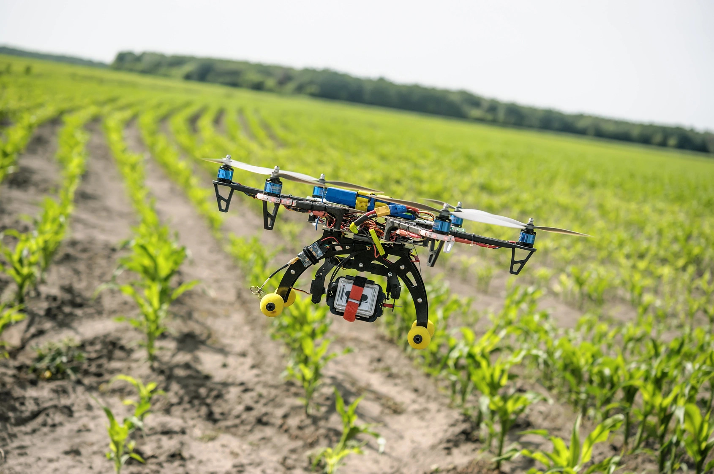
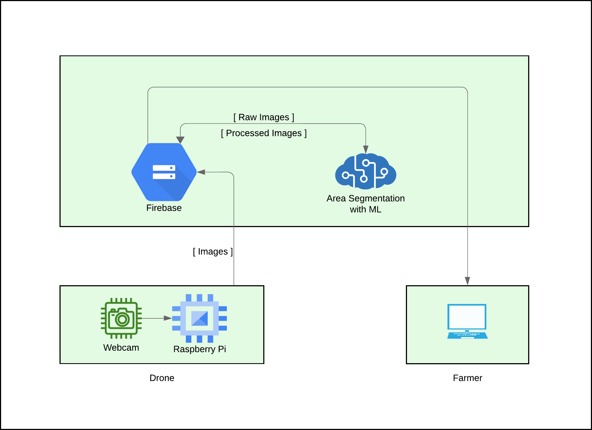
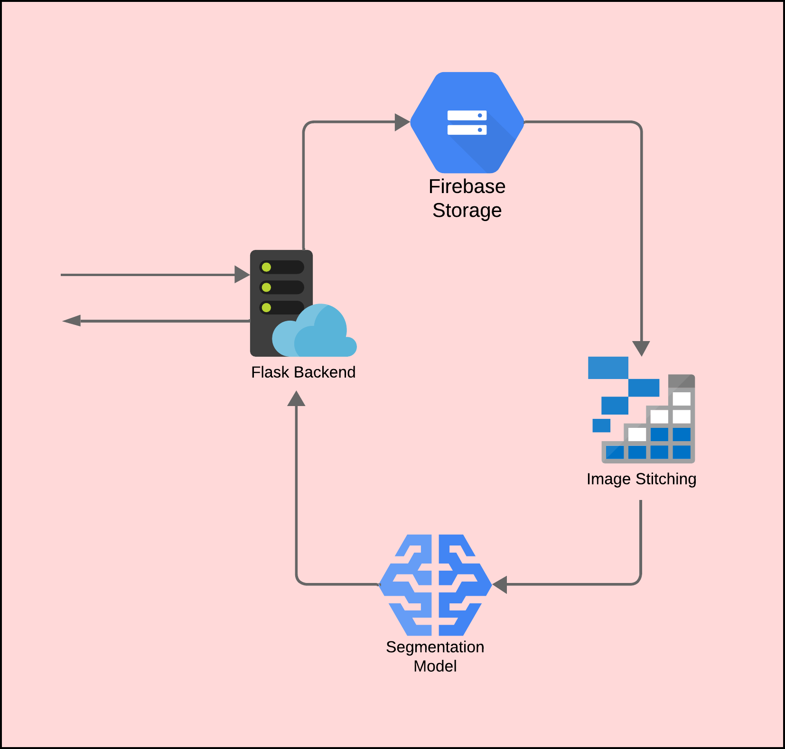
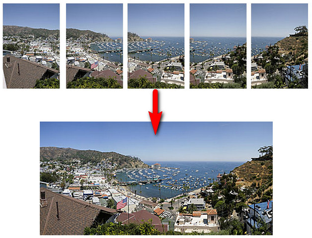
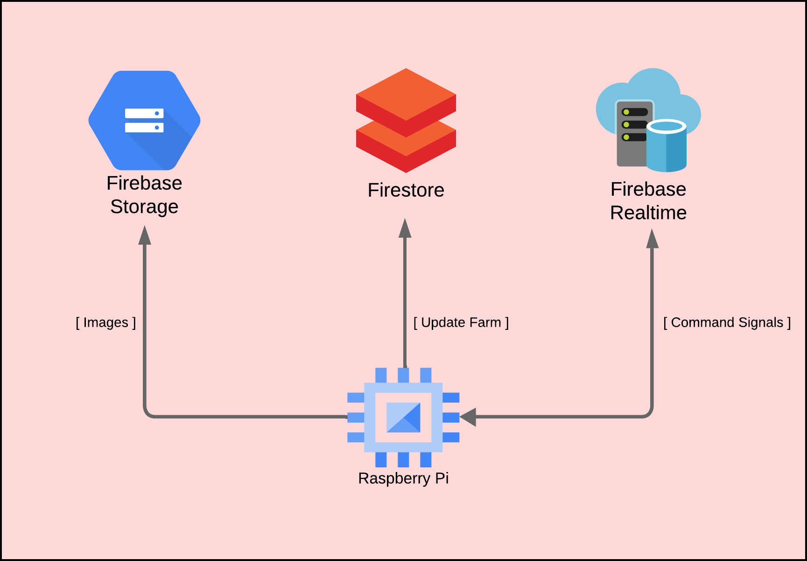

# Aerial Crop Monitoring System

Semester 5 embedded systems project on crop monitoring using a drone.
Local Folder : https://drive.google.com/file/d/1GdXNny6uh2c8acCmL4zzv7WGXyAGMLp3/view?usp=drive_link

## Table of Contents
- [Introduction](#introduction)
- [Project Overview](#Project_Overview)
- [Usage](#usage)
- [Getting Started](#Getting_Started)
- [Image_Stitching](#Image_Stitching)
- [U_Net](#U_Net)
- [License](#license)

## Introduction
The main objective of this project is to provide farmers with valuable insights into the composition of their fields, allowing for efficient land planning and expansion strategies. By accurately identifying cultivated and non-cultivated areas, as well as assessing vegetation presence, farmers can make informed decisions that optimize their agricultural practices and preserve the natural environment.

## Project Overview
Modern agriculture stands to benefit greatly from advancements in technology. In this project, we leverage computer vision algorithms along with drone-based data collection to achieve two main objectives:

1. **Cultivated and Non-Cultivated Area Segmentation:** Through computer vision techniques, we process imagery captured by drones to precisely segment cultivated and non-cultivated areas within the field. This segmentation provides a clear visual representation of the distribution of agricultural activities and natural vegetation.

2. **Vegetation Analysis (future):** By analyzing the collected imagery, we can assess the health and density of vegetation in the field. This information is invaluable for understanding soil quality, identifying potential pest and disease issues, and optimizing overall crop yields.

## Usage

### Precision Land Planning and Expansion

By utilizing drone imagery and computer vision-based segmentation, farmers can accurately identify suitable areas for expansion and development. This technology-driven approach ensures that expansion efforts are directed towards areas that are well-suited for cultivation, preventing the encroachment on ecologically sensitive zones.

### Enhanced Crop Rotation Strategies

Computer vision analysis of non-cultivated areas aids in the planning of effective crop rotation strategies. Understanding the vegetation distribution allows farmers to rotate crops between cultivated and non-cultivated zones strategically, maintaining soil fertility and minimizing agricultural challenges.

## Getting Started

1. **Hardware Setup:** Equip a drone with a web camera capable of capturing high-resolution images.

2. **Data Collection:** Fly the drone over the field and capture images of the entire area.

3. **Image stitching:** Images captured by the drone at certain intervals are stored on Firebase by an onboard Raspberry Pi 3 computer.
   
4. **Flask Backend:** Farmers can use their user interface to analyze images once the drone flight is complete.
   
5. **Computer Vision Processing:** Implement image segmentation algorithms to distinguish cultivated and non-cultivated areas based on visual characteristics.
   
6. **Visualization:** Display the segmentation maps and vegetation percentage through a web app.

## System Diagram

## Flask Backend

## Image_Stitching
Image stitching is a computer vision technique that involves combining multiple overlapping images into a single, seamless panoramic image. The goal of image stitching is to create a larger and wider view of a scene that cannot be captured in a single shot by a camera. This technique is commonly used to create panoramic photographs or to generate wide-field-of-view images for applications such as virtual reality, surveillance, and etc.

In this project, I demonstrate image stitching using OpenCV and Python. The process involves loading images, detecting keypoints using the ORB feature detector, matching keypoints between pairs of images, estimating homography transformations, and applying them to create a seamless panorama. The implementation aligns and blends images to produce a wider view than individual captures. By leveraging OpenCV's feature detection and transformation functions, we achieve an automated and accurate image stitching solution.

## U_Net
U-Net is a convolutional neural network (CNN) architecture designed for semantic segmentation tasks in computer vision. It was introduced in the research paper titled "U-Net: Convolutional Networks for Biomedical Image Segmentation" by Olaf Ronneberger, Philipp Fischer, and Thomas Brox, published in 2015. The U-Net architecture has since become popular for tasks where pixel-wise classification or segmentation is required, such as image segmentation, medical image analysis, and etc. 

In my project, I utilized libraries like `cv2`, `numpy`, `matplotlib`, and `torch` to implement a U-Net architecture. These libraries facilitated image processing, array operations, visualization, and deep learning tasks. By integrating these tools, I achieved a versatile solution that combines various capabilities to address the project's objectives. The code and documentation provide insights into this collaborative approach.

## Edge System

## License
This project is licensed under the [MIT License](LICENSE).
